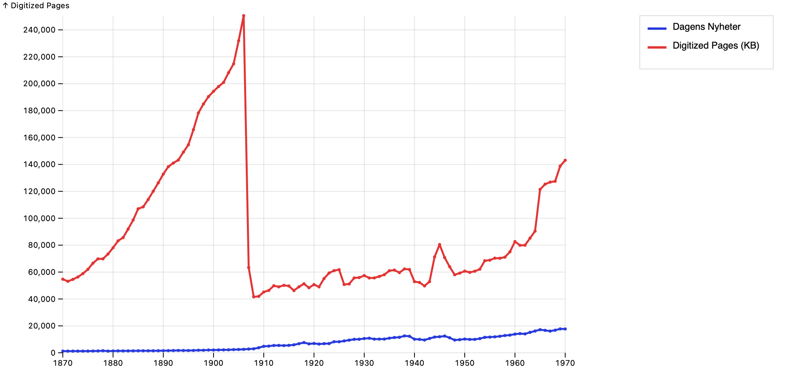
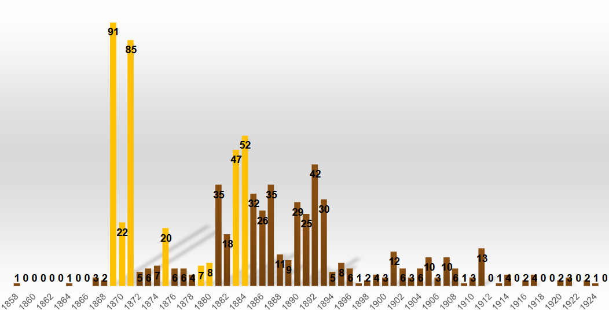

## Follow along

:::: {.columns}

::: {.column width="50%"}
{width=55%}

**Live slides**

<https://ContentiousGatherings.github.io/2026-05-21-uppsala-workshop-slides/>
:::

::: {.column width="50%"}
{width=55%}

**Source on GitHub**

<https://github.com/ContentiousGatherings/2026-05-21-uppsala-workshop-slides>
:::

::::

# Background

## The question

- **1820:** public political meetings were forbidden in Sweden
- **1939:** they were widespread and established
- Something changed — the *repertoire of contention* assumed a modern form
- Who did the changing, when, where, and around what?

# Kungliga Biblioteket

## Kungliga Biblioteket — the good parts

- Digitized daily newspapers, 19th and early 20th century
- 100+ years of local and national reporting
- Public search API since 2024
- A dataset of a kind we could not have built ourselves

## Kungliga Biblioteket — an archive that fights back

- Undocumented, unversioned API
- Pagination capped at 20 hits per page
  - hard ceiling at 10 000 results
- Silent API changes
    - results younger than 150 years suddenly stopped appearing, with no notice

## Kungliga Biblioteket Coverage

# Codebook

## Codebook — what counts as a contentious gathering?

> a number of people - here, ten or more - outside of the government gathered in a public accessible place and made claims on at least one person outside their own number, claims which if realized would affect the
interests of their object (Tilly 1995)

- A **public** event
- Where **people gathered** in a shared physical space
- With a **political** purpose or character
- Excludes: parliamentary sessions, private meetings, board meetings, purely social events

- Research assistants apply the codebook to a sample of articles by hand
- This produces a **validation set** the pipeline will be measured against

# The Pipeline

## Two systems

- `tidningar` — searches the KB API, downloads articles, prepares the text
- `pipeline` — reads articles, extracts events, builds the database

  
KB API

  
→

  
<code>tidningar</code>

  
→

  
<code>pipeline</code>

  
→

  
event database

## Articles → events

The system reads an article and produces:

- **When** did the gathering happen?
- **Where** did it happen?
- **Who** was there?
- **What kind** of gathering was it?

 - Think of it as a research assistant working through a form, one article at a time.

## What we ask the model to do

- **Reading and extracting** — pull events out of an article, fill in date, place, type, participants
- **Splitting compound mentions** — "Wallenberg och arbetarna" → two actors; "Stockholm och Malmö" → two locations
- **Judging between candidates** — when fuzzy matching gives several plausible matches, pick the right one from context
- **Parsing edge cases** — relative date expressions, unusual gathering types that rule-based parsers don't catch

## The 2-of-3 rule

- We keep an event only if at least **two of three** are present:
  - a time
  - a place
  - participants
- One alone is too thin — too much noise, too much risk of misreading
- Three is ideal and common in 19th-century reporting

## From strings to records

- "Stockholm" → a point on a map
- "Direktör Wallenberg och arbetarna" → two actors: Wallenberg + the workers
- "i tisdags" → an actual date (interpreted against the article's publication date)

- This is matching and disambiguation against canonical reference data.

## When the model isn't needed

- The system started passing almost everything through models
- As patterns in the data became visible, we replaced model steps with simpler rules
- **Why:** cheaper, faster, more transparent, more reproducible
- The model is reserved for the cases where rules can't capture the messiness

## Scale and human review

- Pilot: ~770 events extracted
- Each event has a full audit trail — article, excerpt, model output, every post-processing decision
- Borderline cases are surfaced for human review

# Preliminary results

## Timeline

- Pilot data only — not yet the full 1820–1939 sweep
- Visible spikes in 1869 and 1871 — what's going on?

# Geography {.smaller}



# Geography {.smaller}
| Region                 |   1858-1869 |   1870-1879 |   1880-1889 |   1890-1899 |   1900-1909 |   1910-1919 |   1920-1929 |   Total |
|:-----------------------|------------:|------------:|------------:|------------:|------------:|------------:|------------:|--------:|
| Malmöhus län           |           8 |          21 |          42 |          23 |          21 |          10 |           3 |     128 |
| Kristianstad län       |           6 |          17 |          21 |          13 |           4 |          14 |           3 |      78 |
| Stockholm              |           1 |           3 |          30 |          25 |           5 |           1 |           2 |      67 |
| Stockholms län         |           6 |          10 |           9 |           3 |           1 |           0 |           0 |      29 |

- Skåne (Malmöhus, Kristianstad) dominates throughout
- Stockholm rises in the 1880s–90s

## Next steps

1. **Expand newspaper coverage** — ideally to all available newspapers
2. **Expand the number of keywords**
2. **Run validation** against the human-coded set built from the codebook
3. **Add actors and demands** as structured fields — moving from *events* to *who did what and why*

# Thank you

## Resources {.smaller}

Mathias Johansson — `mathias.johansson@kultur.lu.se`

:::: {.columns}

::: {.column width="33%"}
{width=35%}

**Project site**

<https://www.contentiousgatherings.se/>
:::

::: {.column width="33%"}
{width=35%}

**Data viewer**

<https://contentiousgatherings.github.io/data-view/>
:::

::: {.column width="33%"}
{width=35%}

**Pipeline flowchart**

<https://contentiousgatherings.github.io/flowchart/>
:::

::::
